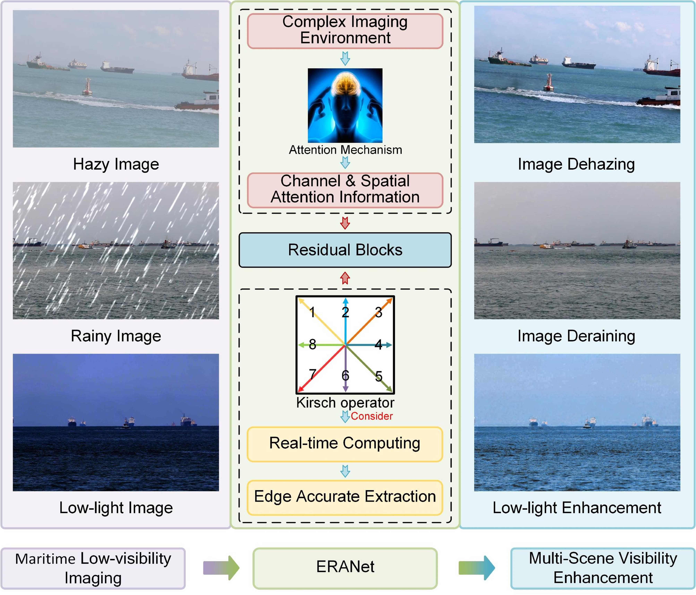
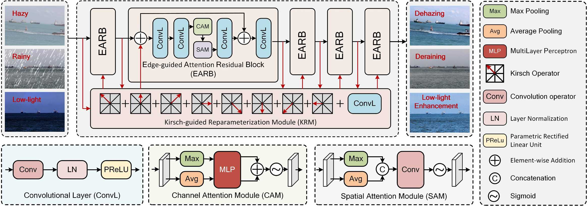
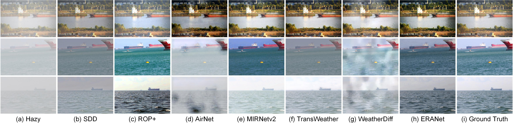
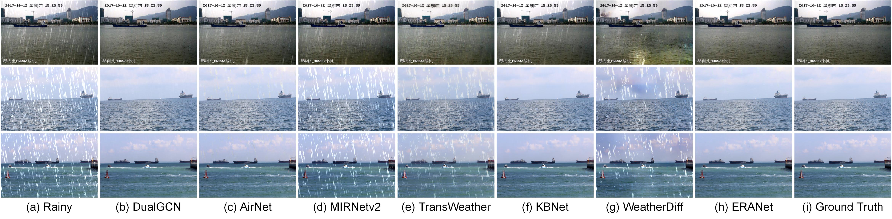
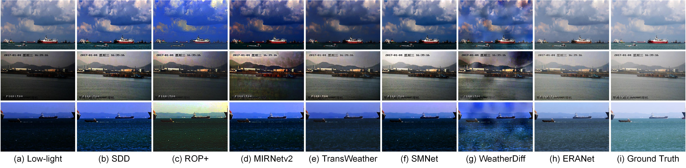

# <p align=center>  Real-Time Multi-Scene Visibility Enhancement for Promoting Navigational Safety of Vessels Under Complex Weather Conditions</p>

<div align="center">


</div>

---
>**Real-Time Multi-Scene Visibility Enhancement for Promoting Navigational Safety of Vessels Under Complex Weather Conditions**<br>  [Ryan Wen Liu](http://mipc.whut.edu.cn/index.html), [Yuxu Lu<sup>*</sup>](https://scholar.google.com.hk/citations?user=XXge2_0AAAAJ&hl=zh-CN), [Yuan Gao](https://scholar.google.com.hk/citations?hl=zh-CN&user=4JpRnU4AAAAJ&view_op=list_works&sortby=pubdate), [Yu Guo](https://gy65896.github.io/), [Wenqi Ren](https://sites.google.com/view/wenqiren/homepage), [Fenghua Zhu](https://scholar.google.com.hk/citations?hl=zh-CN&user=HyQp__AAAAAJ), and [Fei-Yue Wang](https://scholar.google.com.hk/citations?hl=zh-CN&user=_p0NBv0AAAAJ&view_op=list_works&sortby=pubdate) (* indicates corresponding author) <br> 
>Accept by IEEE Transactions on Intelligent Transportation Systems (2024.09.02)

> **Abstract:** *The visible-light camera, which is capable of environment perception and navigation assistance, has emerged as an essential imaging sensor for marine surface vessels in intelligent waterborne transportation systems (IWTS). However, the visual imaging quality inevitably suffers from several kinds of degradations (e.g., limited visibility, low contrast, color distortion, etc.) under complex weather conditions (e.g., haze, rain, and low-lightness). The degraded visual information will accordingly result in inaccurate environment perception and delayed operations for navigational risk. To promote the navigational safety of vessels, many computational methods have been presented to perform visual quality enhancement under poor weather conditions. However, most of these methods are essentially specific-purpose implementation strategies, only available for one specific weather type. To overcome this limitation, we propose to develop a general-purpose multi-scene visibility enhancement method, i.e., edge reparameterization- and attention-guided neural network (ERANet), to adaptively restore the degraded images captured under different weather conditions. In particular, our ERANet simultaneously exploits the channel attention, spatial attention, and reparameterization technology to enhance the visual quality while maintaining low computational cost. Extensive experiments conducted on standard and IWTS-related datasets have demonstrated that our ERANet could outperform several representative visibility enhancement methods in terms of both imaging quality and computational efficiency. The superior performance of IWTS-related object detection and scene segmentation could also be steadily obtained after ERANet-based visibility enhancement under complex weather conditions.*
<hr />

## Requirement

- Python 3.7
- Pytorch 1.12.0

## Motivation


## Network Architecture


## Test
* Place the pre-training weight in the `checkpoint` folder.
* For the dehazing task, place test hazy images in the `input/hazy` folder. Modify the `Type=2`,  the `line 54` of `test.py`.
* For the deraining task, place test rainy images in the `input/rainy` folder. Modify the `Type=0`,  the `line 54` of `test.py`.
* For the low-light enhancement task, place test low-light images in the `input/low` folder. Modify the `Type=1`,  the `line 55` of `test.py`.
* Run `test.py`
* The results are saved in `output/hazy` folder (dehazing), `output/rainy` folder (deraining), `output/low` folder (low-light enhancement).

## Dehazing Results


## Deraining Results


## Low-light Enhancement Results


## Citation

```
@article{liu2024real,
  title={Real-Time Multi-Scene Visibility Enhancement for Promoting Navigational Safety of Vessels Under Complex Weather Conditions},
  author={Liu, Ryan Wen and Lu, Yuxu and Gao, Yuan and Guo, Yu and Ren, Wenqi and Zhu, Fenghua and Wang, Fei-Yue},
  journal={arXiv preprint arXiv:2409.01500},
  year={2024}
}
